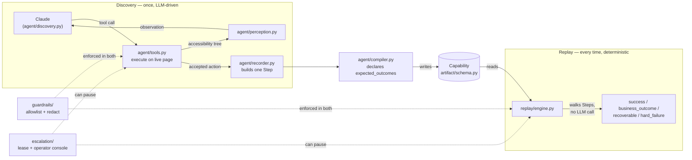

# REPORT

## 1. Architecture

Single Python process, no queues, no services — the assignment explicitly penalizes premature
scaling infrastructure, and nothing here needs it. Six modules, each with one job:

- **`app/`** — the target: a mock legacy core-banking Flask/SQLite app with hostile markup
  (nested tables, non-semantic classes, zero test IDs) over real semantic HTML (`<button>`,
  `<label for>`, `<th scope=row>`), plus a real `<iframe>` boundary for the sub-account
  confirmation step — the stress case for "no clean DOM." Chosen over a desktop app (the
  assignment's other option): the load-bearing pieces — schema, replay determinism, escalation —
  are already surface-agnostic by design (§4), so a desktop target would mean building a second
  perception/action backend without testing a genuinely different kind of robustness question.
- **`agent/perception.py`** — turns whatever Playwright can see into a small
  `{role, name, value, children}` tree, merging content from inside iframes so the LLM never has
  to reason about frame boundaries.
- **`agent/{tools,discovery,recorder}.py`** — the live, LLM-driven observe→decide→act loop, and
  the code that turns each accepted action into a typed `Step` alongside it, not as a later pass
  over a transcript.
- **`agent/compiler.py`** + **`artifact/schema.py`** — turns a run's recorded steps into a
  versioned `Capability`, the contract everything downstream depends on.
- **`replay/engine.py`** — the deterministic, no-LLM production execution path; writes a
  per-step trace that `replay/metrics.py` aggregates and `replay/parallel.py` fans out.
- **`agent/adapters.py`** — the two Protocols (perception / action) that are the only
  surface-specific seam; `WebAdapter` is shipped, `DesktopAdapter` is the marked extension point.
- **`guardrails/`** and **`escalation/`** — cross-cutting: allowlist + sink-aware redaction
  (`guardrails/pii.py`) wired into discovery, replay, and the model prompt; a file-backed lease
  for human handoff.
- **`webconsole/`** — a link-gated web app that streams a live run (the agent console and a
  screenshot feed of the browser it's driving) over SSE, with an in-page Approve/Decline for
  escalations. `agent/discovery.py` and `replay/engine.py` grew one `on_event` hook each to
  feed it; nothing else changed.

The `Capability` artifact is the seam: everything to its left is LLM-driven and runs once per new
task; everything to its right is deterministic and runs every time after.

**Trade-off — perception API.** The build brief specified `page.accessibility.snapshot()`, removed
in current Playwright (verified directly: `AttributeError`). Rebuilt on `Locator.aria_snapshot()`
(YAML text) with per-frame snapshotting, since a top-level snapshot doesn't reach iframe content
by default — also verified directly, not assumed.

**Trade-off — model.** `claude-sonnet-5`, not the largest available: a production
capability-discovery agent for a bank needs cost/latency control and reliable adherence to one
explicit safety rule (escalate before irreversible actions) more than frontier reasoning on a task
this constrained.

## 2. Artifact schema

`artifact/schema.py` — the most heavily-invested piece. A `Capability` is: `schema_version`
(so an older artifact can be migrated forward, not silently misread), `lifecycle`
(`draft`/`verified`/`published`/`deprecated`) and an optional `VerificationRecord`,
`capability_id`, semver `version`, `created_from_run_id`, `description` (the discovery goal,
verbatim), `target`, `risk_level` (`safe`/`risky`), typed `input_schema`/`output_schema`, a
`checkpoint`, and `steps: list[Step]`.

Each `Step` carries a `LocatorTarget` (`strategy`, `primary`, `fallbacks`, and a required
`reasoning` string — a locator with no stated reasoning is exactly the kind of unreviewable
artifact this schema exists to prevent), a `value` that's either a literal or
`{"param_ref": "member_id"}`, and — the load-bearing field — `expected_outcomes:
list[ExpectedOutcome]`, each `{condition, classification, code, handling, provenance}` with
`classification` one of `business_outcome` / `recoverable` / `hard_failure` /
`data_unavailable`. Replay evaluates them as **literal, deterministic checks** against the live
page — never a guess, never an LLM call.

**Where domain knowledge comes from — the biggest change this round.** It used to be Python
dicts keyed by `capability_id` inside `agent/compiler.py` and `scripts/run_discovery.py`, which
meant onboarding a new target app required a code change by whoever explored it. Now every rule
is tagged with `provenance`:
- **curated** — `app_knowledge/<app_name>.yaml`, loaded by `target.app_name`. Outcome branches,
  extract contracts, per-capability risk level + checkpoint + `verify_scenarios`. A human has
  signed off.
- **proposed** — the discovery agent's own `note_branch` / `note_data_shape` tool calls, from
  what it explored this run. Replay uses them (a real signal), but `Capability.lifecycle` stays
  `draft` and `unratified_rules()` is non-empty until a reviewer promotes them into the YAML
  (`scripts/review_capability.py`). Onboarding a new app is now: point discovery at it, review
  the proposals, write the YAML — no code change.

`replay/verify.py:verify_capability` replays every `verify_scenario` and, on a clean sweep with
no unratified rules, promotes `draft → verified` and stamps a `VerificationRecord` on the
artifact — turning §3's manual "re-sweep the whole matrix live" discipline into a gate.

One capability owns many steps, and each step owns its own locator and its own set of expected
outcomes — nothing shared or global, so a fix to one step's outcome rules can never silently
affect another's.

This design point produced the build's most interesting bug: a declared `PERMISSION_DENIED`
outcome was attached to the wrong step, reasoned from server-side route logic instead of what the
UI actually renders. The fix was to replay every declared branch against the real app — checkable
specifically because outcomes live per-step, not in one unstructured `on_error` field that
wouldn't have surfaced *which* step was wrong.

## 3. Determinism & error handling

Replay resolves every `Step.target` the same way the recorder declared it: tier 1 `role_name`
(unique role+accessible-name, backed by real semantic HTML, not CSS/IDs), tier 2 `structural`
(declared `nth` when role+name isn't unique), tier 3 `text` (raw text-content match, logged as a
warning), tier 4 `table_position` (a data-table cell with no per-row label, addressed by column
headers + row/column index instead of content — found live extending past the two required
capabilities into a transaction-history table, where a value-anchored locator broke the moment a
different member's data differed). **The tier log doubles as a free drift-detection signal**:
rising tier-2/3/4 usage across replays means the UI drifted, at zero extra cost — the same signal
covers per-tenant drift in §4.

Each step's `expected_outcomes` are checked deterministically: when a locator can't be resolved
(or an action fails), and after every successful action, replay checks whether any declared
`condition` (a literal `"page contains '<substring>'"`) matches the live page. A match returns
`business_outcome` or `recoverable`; no match on a failure is `hard_failure`, with `step_id`,
`expected`, `observed`, and a screenshot reference. `recoverable` stops just as cleanly as
`business_outcome` rather than retrying in-place — silently retrying an unrecognized page state is
the wrong instinct for a banking system; what it buys the *caller* is a status distinct from
`hard_failure` ("safe to retry later" vs. "something's broken"). None of the 5 real capabilities
declare one, since this app has no naturally-occurring transient state to retry against —
exercised in `tests/test_replay.py` instead of live, since fabricating one would mean building
non-deterministic app behavior, against this section's own goal.

**Page access without data access.** A distinct failure mode from the above: replay reaches the
page, the markup is intact, a locator resolves — but the *datum* the step exists to read isn't
actually there (an empty or placeholder cell, or a data region that never finished loading). The
first instance of this was patched per-capability — `lookup_latest_transaction`'s
`NO_TRANSACTIONS` outcome exists because an empty transaction table renders a placeholder row
that a position-based locator would otherwise return as a real date. Generalized now into the
core: an `extract` step can carry a declared `ExtractContract` (a value shape — a currency
amount, an ISO date — plus a placeholder list), and a step can carry a `ready_when` gate.
Replay checks the extracted value against its contract right after pulling it; a miss is a new
top-level status, **`data_unavailable`** — not `success` with a junk value, and not
`hard_failure`, because nothing is broken and investigating the automation won't help. What it
buys the caller is the third distinct signal it actually needs: retry later, read from another
source, or surface "not available right now" to its own user. Contracts are authored at compile
time from domain knowledge, same as `expected_outcomes` (`agent/compiler.py`'s
curated (`app_knowledge/<app>.yaml`) or proposed by the discovery agent (§2), and
`scripts/patch_capabilities.py` re-applies the YAML to already-compiled artifacts idempotently.
Verified live: a seeded member (`77777`) whose detail page renders normally but whose balance
the ledger layer returns as `NULL` replays as `data_unavailable` with evidence, where before it
was a silent `success` carrying the label text as the "balance" — that last leak (the extractor
falling back to the label's own text on an empty cell) is fixed, so the `observed` field now
reads `""` instead of `"Savings Balance"`.

**Observability, retries, idempotency.** Every replay writes a structured trace —
`evidence/replay_<run_id>_trace.jsonl`, one line per step: `{step_id, action_type, tier, ms,
outcome}` — carried back on `Result.trace`. `replay/metrics.py` aggregates a directory of these
into per-capability numbers a team watches in production: outcome mix, p50/p95 latency, and
**locator-fallback rate** (the "free drift signal" as one alertable number).
`replay/parallel.py:replay_many` runs a batch through a **warm `BrowserPool`** — `replay()` is
split into browser-lifecycle + `_run_on_page(page)`, so the default `concurrency=1` batch path
launches Chromium once and hands each run an isolated `new_context()`, instead of paying
~0.5s/launch × N. `common/retry.py` wraps the discovery LLM call with exponential backoff +
full jitter for transient errors only (connection / 5xx / rate-limit — never a
`business_outcome`), and discovery tracks token usage per run (the only LLM cost) and reports
an indicative dollar figure. `replay/idempotency.py` gives risky replays a ledger: a
state-mutating capability replayed twice under the same `idempotency_key` returns the first
run's outcome (`Result.idempotent_replay=True`) instead of opening a second sub-account.
`common/logging.py` is a stdlib JSON logger with a `run_id` contextvar; the machine-facing
`print()`s in `replay/engine.py`, `agent/compiler.py`, `guardrails/pii.py`,
`replay/idempotency.py` now go through it (CLI scripts keep `print` for human output).

**Parameter naming** is the agent's job: the `type` and `navigate` tools take a `param_name`
(plus a `url_template` for a partly-parameterized navigation), so the model names each run
input as it uses the value, and it flows straight into `Capability.input_schema` — a general
slot-filler, any number of inputs, replacing the old single hardcoded `member (\d+)` regex
(kept only as a fallback).

All four required scenarios ran against real compiled capabilities — success with a
never-recorded `member_id`, both business outcomes, an injected hard failure — real output in
`/evidence/`. Verification went past the two required capabilities: discovery was pointed at real
app features with zero prior capability and fresh goal wording each time
(`lookup_latest_transaction`, `dispute_transaction`, `update_member_address`), and the full
outcome matrix was re-swept live across all 5 capabilities after every round of changes rather
than trusting earlier verification still held. That discipline caught this section's own failure
mode twice, inverted — a business outcome misreported as a break: two capabilities missing
`expected_outcomes` a third already had, and later a stale artifact plus a genuine idempotency bug
in the rule-patching function itself. Both closed the same way: re-verified live, immediately.

## 4. Heterogeneity & multi-tenant

The seam is in place and now proven on a non-web surface. Perception and `agent/tools.py` are
the only Playwright-specific modules; recorder, schema, and replay engine only ever see
`{role, name, value, children}` and role/name-addressed actions. That contract is two
`runtime_checkable` Protocols in `agent/adapters.py` — `PerceptionAdapter.observe()` and
`ActionExecutor.click/type_text/navigate/extract()`. `WebAdapter` wraps the shipped web
functions; **`DesktopAdapter` (`agent/desktop_adapter.py`) is a real implementation**, not a
stub — it runs against `desktop/mock_ax.py`, an in-process stand-in for Windows UIA / macOS AX,
and `tests/test_desktop_adapter.py` drives a full discovery-like sequence and a replay-like
extraction through it (happy path, not-found, locked-account, empty-cell), producing the exact
same normalised tree from a control tree with no HTML anywhere. A production desktop backend
swaps `desktop/mock_ax.py` for `pywinauto` / `pyobjc` + AXUIElement; schema, recorder, replay,
guardrails don't change. `tests/test_adapters.py` asserts both adapters satisfy the Protocols,
so the claim can't rot silently.

**Multi-tenant reuse** — now built, not just designed. `artifact/patch.py:apply_patch(base,
patch)` represents a capability as a **base + per-tenant patch**: the base is what most tenants
running the same vendor product replay unmodified; a tenant whose instance differs (rebrand, a
renamed field, an extra step) gets a small patch — top-level field overrides deep-merged, plus
step overrides keyed by `step_id` — applied over the base, re-validated against the schema so a
patch can't silently produce a broken artifact. Verified live: the mock app has a
`BANK_VARIANT=acme` mode that relabels one row header;
`capabilities/tenants/acme.lookup_member_balance.patch.json` is a 3-line patch, and
`scripts/smoke_test_tenant_patch.py` shows the base capability `hard_failure`-ing on that
tenant (locator `unresolved`) while base+patch succeeds. Drift detection reuses §3's tier log
(`replay/metrics.py` computes a per-capability locator-fallback rate): a spike for one tenant
signals either the base needs updating or that tenant needs its own patch, without touching the
others.

## 5. Escalation & handoff

A file-backed **lease** (`state: automation|human`, `context`) is the entire "who's in control"
model. `trigger_escalation` flips it to `human`, captures a screenshot + reason + URL + run ID to
`/evidence/`, and **blocks** — polling a resume signal — until a separate
`escalation/operator_page.py` Flask process (a real second web server) posts a real HTTP
`/resume`. Playwright runs in a **persistent, non-headless-capable** context specifically so this
is the literal same live session a human takes over, not a fresh one.

Triggers: the dead-end detector (3 consecutive turns with an identical accessibility-tree hash,
tested live and offline); the model voluntarily calling `escalate` (observed live: given a goal
requiring an irreversible submit, the model escalated on its own); and — added for the live
console — a **declarative policy** (`escalation/policy.py`, rules in `escalation/rules.yaml`)
evaluated deterministically before every state-changing step, in **replay as well as discovery**.
A rule matches on `capability_id` / `risk_level` / `target_app` / step action / step-name
substring / a run-param comparison, and resolves to `allow` / `escalate` / `block`; first match
wins. It is the floor under the model's judgment in discovery (it forces a pause even if the
model didn't choose one) and the *only* gate in replay (no model there). Rules are editable at
runtime from the console's "Escalation rules" panel; a step the operator declines ends the run
as `business_outcome / OPERATOR_DECLINED`. When no live operator is available (CLI, CI) a risky
capability still needs `confirm=True` up front — `allow_escalation` is what switches replay from
"refuse" to "pause for a person."

Two real gaps surfaced by actually running this live, both with a user operating the escalation UI
themselves: the resume signal originally carried only a free-text note with no way to distinguish
"approved" from "declined," and the dead-end path threaded nothing back at all, so a human's own
note on resume silently went nowhere either way. Fixed by threading a structured `decision` + note
back through the lease's context — this is what let `open_subaccount` get recorded to completion
by one unattended run instead of a human clicking through it live. A third gap was pure UX: the
operator console makes escalation obvious to whoever's looking *there*, but the automation's own
browser window showed nothing. Fixed with a small on-page banner, `aria-hidden` (verified it never
leaks into the model's own perception) and removed on resume.

## 6. Safety

`guardrail_check(action, current_url)` — allowlisted domains and action types, loaded once at
startup, checked before every action in **both** discovery and replay. Any violation raises and
halts, with no silent skip and no in-band bypass — demonstrated live, an out-of-allowlist
navigation blocked and the transcript saved to `/evidence/`.

`check_risk_confirmation(risk_level, confirm)` is separate: `risky` replay refuses to execute past
confirmation without explicit `confirm=True`, checked before the browser even launches.

`redact(obj)` runs two always-on hard passes: by **key** (`{ssn, account_number, password,
token}`, substring — not applied to `input_schema`/`output_schema` after `account_number`
collided with a legitimately named `sub_account_number` field and corrupted its type
descriptor), and by **value shape** (an SSN- or card-number-like digit run is masked regardless
of key name — verified against 1,000 random SHA256 hashes with zero false positives).

**The gray area** — names, addresses, emails, phone numbers — was the hard part, and the answer
is that "redact names: yes/no" is the wrong question: a name in a capability's `output_schema`
is the point of the capability, while the same name in a page observation shipped to a
third-party model is a leak. So `redact(obj, sink=...)` decides by **destination**:
`"artifact"` (default) is byte-for-byte the old behavior — hard passes only, gray-area data
passes through; `"evidence"` tokenizes gray-area entities (`<PERSON_1>`, reversible under audit
via a returned map, so a transcript stays followable); `"llm_prompt"` hard-masks them, and this
is now wired into `agent/discovery.py` so every observation is scrubbed before it leaves, with
the per-turn `RedactionReport` (counts, plus a **low-confidence 0.4–0.7 band flagged for human
review** rather than silently kept or dropped) written into the transcript. Ambiguous bare
numerics — a lone 5-digit ZIP, a long digit run — are deliberately **flagged but not masked**
in any sink: a computer-use agent navigates by exactly those IDs, so masking `member 12345`
would break discovery. Detection is **Microsoft Presidio** (`requirements-pii.txt`, optional)
for real PERSON/LOCATION NER with confidence scores, or a regex fallback (email / phone /
street address) that is honest about not finding names without it. `guardrails/pii.py`;
`scripts/demo_gray_area_redaction.py` shows one observation through all three sinks.

The compliance frame that actually applies here is **GLBA** (the Safeguards Rule), not HIPAA. Three
follow-on gaps this raised got real fixes, not caveats: **discovery-vs-replay domain separation**
— every discovery turn sends page content to a third-party LLM, so `guardrail_check(phase=...)`
now checks a stricter `discovery_allowed_domains` list, *and* the observation itself is now
scrubbed with `sink="llm_prompt"` before it goes (above) — domain separation and content
redaction, not one or the other; **operator console authentication** — the
single most safety-critical gap, since whoever could reach it could approve an irreversible
action, now HTTP Basic Auth, verified live that an unauthenticated `/resume` is rejected and the
lease stays untouched; and **encryption at rest** (`guardrails/encryption.py`, real `Fernet`
authenticated encryption, keyed from `.env` the same way `ANTHROPIC_API_KEY` already is), verified
writing a customer-shaped record and confirming nothing — not even valid JSON — survives on disk
without the key. Deliberately not applied to this repo's own `/evidence/`/`capabilities/`, since
the assignment requires those stay reviewable. Honest limit on all three: one static key, no
rotation, no HSM custody — a real KMS is the credible next step.

## 7. Cuts

- **Desktop adapter runs against an in-process mock AX tree** (`desktop/mock_ax.py`), not a
  real OS accessibility client — enough to prove the seam holds off Playwright (§4), not a
  shipped Windows/macOS backend. The multi-tenant base+patch model *is* built and tested live
  (§4); a tenant *registry* / per-tenant drift dashboard is not.
- **`schema_version` is a field but there's no `migrate()` yet** — a v1.0 artifact loads under
  the v1.1 model via pydantic defaults, which is fine for this one bump but not a general
  migration path.
- **Operator console UI is intentionally bare** — the scope note allows this; *access* to it is
  what had to be real, and is (section 6).
- **Parameter naming**: the agent names its own run inputs via `param_name` on the `type` /
  `navigate` tools (the general slot-filler — any number, any names). The old `member (\d+)`
  goal-text regex is kept only as a fallback for a model that forgets to tag a value.
- **Gray-area PII detection**: real NER (PERSON/LOCATION) only if `requirements-pii.txt`
  (Presidio) is installed; the regex fallback finds email/phone/address but not names, and says
  so. The low-confidence review queue (`evidence/redaction_review.jsonl`) is written but nothing
  consumes it yet — it's a file for a human, not a workflow.
- **Browser pool is single-threaded** — `BrowserPool` reuses one warm Chromium across a batch
  (`replay_many(concurrency=1)`), so a 400-run batch launches the browser once, not 400 times.
  `concurrency>1` still means a browser per worker thread (sync Playwright isn't safe to share);
  a genuinely concurrent *pooled* executor would need a browser-per-thread pool.
- **Tier-2 structural locator is simplified** ("first match in DOM order," not a richer
  relative-position description) — real but only exercised via fake match counts in
  `tests/test_recorder.py`, since this app's own role+name pairs are unique by design.
- **Action vocabulary is `click`/`type`/`navigate`/`extract` only** — no drag or file-upload
  primitive. `<select>` dropdowns *are* covered (`type` falls back to `select_option()`) — a
  code-review pass found this fallback, and every non-timeout Playwright error in
  `agent/tools.py`, was silently unreachable due to an overly narrow `except`, fixed and verified
  live with a goal needing `open_subaccount`'s non-default account type.
- **Only one stretch goal attempted** (§8) — depth over breadth per the assignment's own
  guidance; time otherwise went into verifying every core requirement's full outcome matrix live
  (the two required capabilities × all 4 replay scenarios each, a live escalation demo, many real
  bugs found and fixed) rather than adding surfaces on top of a less-verified core.
- **What I'd build next**: a real OS-accessibility desktop backend (the mock AX seam is
  proven); a browser-per-thread pool so `replay_many` is both warm *and* concurrent; a real KMS
  (rotation, envelope encryption, audit-logged key access) in place of
  `EVIDENCE_ENCRYPTION_KEY`'s single static key; and turning the redaction review queue into an
  actual triage workflow.

## 8. Stretch goal: agent-facing capability interface

`agent_interface/` exposes every real `capabilities/*.json` as a Claude tool-use catalog
(`catalog.py`) and an invocation surface (`invoke.py`). `Capability.input_schema` is already
`{param: {"type", "description"}}` — a JSON-Schema `properties` object — so the mapping to a tool
is direct, not a translation layer that could drift from what `replay()` accepts. Added
`Capability.description` (a real schema gap: nothing previously carried what a capability *does*
in natural language, only its typed I/O), populated from the discovery goal and patched onto all
5 existing artifacts.

**Safety property, not an afterthought**: `confirm` is a parameter of `invoke_capability()`, never
a field in the tool schema an LLM sees — exposing it would let a model set `confirm=True` on its
own tool call and defeat `check_risk_confirmation`'s server-side gate.

**The first live run found a real bug**: asked "What's the current balance for member 23456?",
Claude had `lookup_member_balance` available with `member_id` declared as a required parameter —
and declined to call it, reading the literal description "member 12345" (the historical discovery
goal, verbatim) as the tool being hardcoded to that member. Fixed by reusing existing logic:
`_generalize_description` runs the same regex `agent/recorder.py` already uses to find a
parameterized ID, rewriting "member 12345" → "a member (member_id)" only when `member_id` is
actually declared. Re-ran the same live demo after the fix: Claude correctly called
`lookup_member_balance({"member_id": "23456"})`, the deterministic replay engine returned that
member's actual balance, and Claude's answer was correct. Both runs' transcripts are in
`/evidence/`. 10 new tests (`tests/test_agent_interface.py`).
