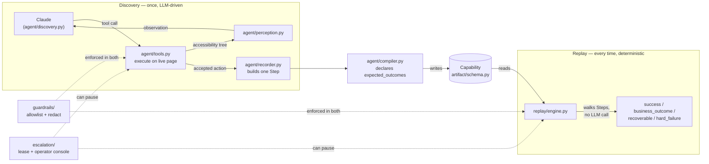
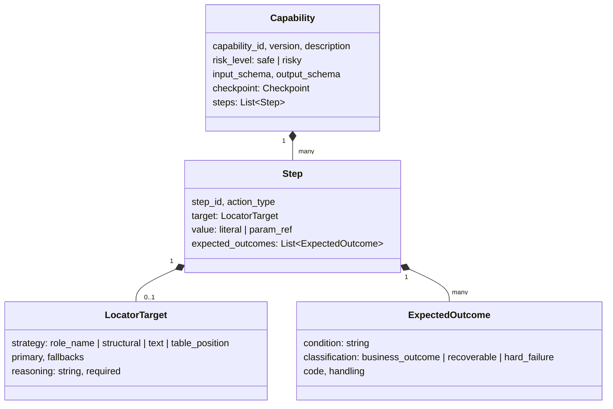

# REPORT

## 1. Architecture

Single Python process, no queues, no services — the assignment explicitly penalizes premature
scaling infrastructure, and nothing here needs it. Six modules, each with one job:

- **`app/`** — the target: a mock legacy core-banking Flask/SQLite app with hostile markup
  (nested tables, non-semantic classes, zero test IDs) over real semantic HTML (`<button>`,
  `<label for>`, `<th scope=row>`), plus a real `<iframe>` boundary for the sub-account
  confirmation step — the stress case for "no clean DOM." Chosen over a desktop app (the
  assignment's other suggested option): a desktop surface needs OS-level accessibility automation
  as a second perception/action backend without adding a genuinely different *kind* of robustness
  question — the load-bearing pieces (schema, replay determinism, escalation) are
  surface-agnostic by design either way (section 4), so a web target let effort go there instead
  of into a second integration surface.
- **`agent/perception.py`** — turns whatever Playwright can see into a small
  `{role, name, value, children}` tree, merging content from inside iframes so the LLM never has
  to reason about frame boundaries.
- **`agent/{tools,discovery,recorder}.py`** — the live, LLM-driven observe→decide→act loop, and
  the code that turns each accepted action into a typed `Step` alongside it, not as a later pass
  over a transcript.
- **`agent/compiler.py`** + **`artifact/schema.py`** — turns a run's recorded steps into a
  versioned `Capability`, the contract everything downstream depends on.
- **`replay/engine.py`** — the deterministic, no-LLM production execution path.
- **`guardrails/`** and **`escalation/`** — cross-cutting: allowlist + redaction wired into both
  discovery and replay; a file-backed lease for human handoff.

The `Capability` artifact is the seam: everything to its left is LLM-driven and runs once per new
task; everything to its right is deterministic and runs every time after.

**Trade-off — perception API.** The build brief specified `page.accessibility.snapshot()`, which
no longer exists in current Playwright (`AttributeError: 'Page' object has no attribute
'accessibility'`, verified directly). Rebuilt on `Locator.aria_snapshot()` (YAML text) instead,
with per-frame snapshotting to cross iframe boundaries — a top-level snapshot does *not* reach
iframe content by default (also verified directly, not assumed).

**Trade-off — model.** `claude-sonnet-5`, not the largest available model: this is a production
capability-discovery agent for a bank, where cost/latency and reliably following one explicit
safety rule (escalate before irreversible actions) matter more than frontier reasoning on a task
this constrained.

## 2. Artifact schema

`artifact/schema.py` — the most heavily-invested piece. A `Capability` is: `capability_id`,
semver `version`, `created_from_run_id` (provenance), `description` (the discovery goal, verbatim
— added for §8's stretch goal, since nothing previously carried what a capability *does* in
natural language, only its typed I/O), `target`, `risk_level` (`safe`/`risky`), typed
`input_schema`/`output_schema`, a `checkpoint`, and `steps: list[Step]`.

Each `Step` carries a `LocatorTarget` (`strategy`, `primary`, `fallbacks`, and a required
`reasoning` string — a locator with no stated reasoning is exactly the kind of unreviewable
artifact this schema exists to prevent), a `value` that's either a literal or
`{"param_ref": "member_id"}`, and — the load-bearing field — `expected_outcomes:
list[ExpectedOutcome]`, each `{condition, classification, code, handling}` with `classification`
one of `business_outcome` / `recoverable` / `hard_failure`. These are declared by
`agent/compiler.py` from domain knowledge of the target app (one discovery run only observes its
own happy path; finalizing a capability for production means documenting the branches you know
exist, same spirit as `reasoning`), and replay evaluates them as **literal, deterministic
checks** against the live page — never a guess, never an LLM call.

This exact design point produced the most interesting bug in this build: a declared
`PERMISSION_DENIED` outcome was attached to the wrong step because it was reasoned from
server-side route logic instead of what the UI actually renders. The fix wasn't "trust the
schema less," it was "replay every declared branch against the real app" — which the schema's
shape makes checkable in the first place. A single unstructured `on_error` field wouldn't have
surfaced *which step* was wrong this clearly.

## 3. Determinism & error handling

Replay resolves every `Step.target` the same way the recorder declared it: tier 1 `role_name`
(unique role+accessible-name, backed by real semantic HTML, not CSS/IDs), tier 2 `structural`
(declared `nth` when role+name isn't unique), tier 3 `text` (raw text-content match, logged as a
warning), tier 4 `table_position` (a data-table cell with no per-row label, addressed by its
table's column headers + row/column index instead of content — found live extending past the two
required capabilities into a transaction-history table, where a value-anchored locator broke the
moment a different member's data differed). **The tier log doubles as a free
drift-detection signal**: rising tier-2/3/4 usage across replays means the UI drifted, at zero
extra infrastructure cost — the same signal covers per-tenant drift in section 4.

Each step's `expected_outcomes` are checked deterministically: when a declared locator can't be
resolved (or fails to act), and after a successful action, replay checks whether any declared
`condition` (a literal `"page contains '<substring>'"`) matches the live page. A match returns
`business_outcome` or `recoverable`; no match on a failure is `hard_failure`, with `step_id`,
`expected`, `observed`, and a screenshot reference. `recoverable` stops just as cleanly as
`business_outcome` rather than retrying in-place — a replay engine that silently retries an
unrecognized page state is the wrong instinct for a banking system; what it buys the *caller* is a
status distinct from `hard_failure` ("safe to retry later" vs. "something's broken, investigate").
None of the 5 real capabilities declare one, since this app's business logic has no
naturally-occurring transient state to retry against — exercised in `tests/test_replay.py`
instead of live, since fabricating one would mean building non-deterministic app behavior,
directly against this section's own goal.

All four required scenarios ran against real compiled capabilities: success with a never-recorded
`member_id`, both business outcomes, and an injected hard failure — real output in `/evidence/`.
Verification didn't stop at the two required capabilities: discovery was pointed at real app
features with zero prior capability and fresh goal wording each time (`lookup_latest_transaction`,
`dispute_transaction`, `update_member_address` — 3 more, to the same standard), and the full
outcome matrix was re-swept live across all 5 capabilities after every round of changes rather
than trusting earlier verification still held. That discipline is exactly what caught this
section's own named failure mode, twice, inverted (a business outcome misreported as a break, not
the usual direction) — two capabilities missing `expected_outcomes` a third already had, and later
a stale artifact plus a genuine idempotency bug in the rule-patching function itself, found while
fixing the first. Both closed the same way: re-verified live, immediately, not left as a claim.

## 4. Heterogeneity & multi-tenant

Not built — design only, per scope. The seam that matters is already in place: perception and
`agent/tools.py` are the only Playwright-specific modules; recorder, schema, and replay engine
only ever see `{role, name, value, children}` and role/name-addressed actions. A **legacy web
app** with worse markup needs no changes (this app already is one). A **desktop app** needs a
different perception adapter (OS accessibility APIs — Windows UIA / macOS AX, exposing the same
shape natively) and action executor, but the same `Capability` schema, 4-tier fallback concept,
and replay contract.

**Multi-tenant reuse**: represent a capability as a **base + per-tenant patch** instead of one
artifact per tenant. The base is what most tenants running the same vendor product replay
unmodified. A tenant whose instance differs (rebrand, a renamed field, an extra step) gets a
small patch — step overrides keyed by `step_id`, listing only what differs — applied over the
base at replay time. Drift detection reuses the tier log from section 3: a tier-2/3 spike for
one tenant signals either the base needs updating or that tenant needs its own patch, without
touching the others. A patch is just a partial `Capability` — no new schema needed.

## 5. Escalation & handoff

A file-backed **lease** (`state: automation|human`, `context`) is the entire "who's in control"
model. `trigger_escalation` flips it to `human`, captures a screenshot + reason + URL + run ID
to `/evidence/`, and **blocks** — polling a resume signal — until a separate
`escalation/operator_page.py` Flask process (a real second web server, not an in-process mock)
posts a real HTTP `/resume`. Playwright runs in a **persistent, non-headless-capable** context
specifically so this is the literal same live session a human takes over, not a fresh one.

Triggers: the dead-end detector (3 consecutive turns with an identical accessibility-tree hash,
tested live and offline), a `risk_level: risky` step needing confirmation, or the model
voluntarily calling `escalate` (observed live: given a goal requiring an irreversible submit,
the model escalated on its own, citing the exact policy rule from its system prompt).

Three gaps here were found by actually running this live — twice by a user genuinely operating
the escalation UI, not just by me: the resume signal originally carried only a free-text note with
no way to distinguish "approved" from "declined," and separately the dead-end path threaded
nothing back at all, so a human's own note on resume silently went nowhere in either case — both
fixed by threading a structured `decision` + note back through the lease's context, which is what
let `open_subaccount` get recorded to completion by one real, unattended run instead of a human
sitting and clicking through it live. The third was pure UX, not data loss: the operator console
makes escalation obvious to whoever's looking *there*, but the automation's own browser window —
the one actually being handed over — showed nothing. Fixed with a small on-page banner,
`aria-hidden` (verified live it never leaks into the model's own perception) and removed on
resume.

## 6. Safety

`guardrail_check(action, current_url)` — allowlisted domains and action types, loaded once at
startup, checked before every action in **both** discovery and replay. Any violation raises and
halts; there's no silent skip and no in-band bypass. Demonstrated live: an out-of-allowlist
navigation is blocked and the transcript saved to `/evidence/`.

`check_risk_confirmation(risk_level, confirm)` is separate: `risk_level: risky` replay refuses
to execute past confirmation without explicit `confirm=True`, checked before the browser
launches.

`redact(obj)` runs two passes: by **key** (`{ssn, account_number, password, token}`, substring —
not applied to `input_schema`/`output_schema` after `account_number` collided with a
legitimately-named `sub_account_number` field and corrupted its type descriptor), and by **value
shape** (an SSN- or card-number-like digit run is masked regardless of key name — verified against
1,000 random SHA256 hashes with zero false positives, and deliberately does *not* flag a name or
currency balance, since those belong in a capability's declared outputs). Full PII detection
remains an explicit cut.

The compliance frame that actually applies to a US bank is **GLBA** (the Safeguards Rule), not
HIPAA (healthcare-specific). Three follow-on gaps this raised got real, verified fixes rather than
write-up caveats: **discovery-vs-replay domain separation** — every discovery turn sends page
content to a third-party LLM, so `guardrail_check(phase=...)` now checks a stricter
`discovery_allowed_domains` list independent of the general replay allowlist; **operator console
authentication** — the single most safety-critical gap, since whoever could reach it could approve
an irreversible action, now HTTP Basic Auth, fail-secure, verified live that an unauthenticated
`/resume` is rejected and the lease provably stays untouched; and **encryption at rest**
(`guardrails/encryption.py`, real `Fernet` authenticated encryption, keyed from `.env` the same
way `ANTHROPIC_API_KEY` already is), verified writing a customer-shaped record and confirming
nothing — not even valid JSON — survives on disk. Deliberately not applied to this repo's own
`/evidence/`/`capabilities/`, since the assignment requires those stay reviewable. Honest limit on
all three: one static key, no rotation, no HSM custody — a real KMS is the credible next step.

## 7. Cuts

- **Desktop support and real multi-tenant infrastructure**: design-only (section 4).
- **Operator console UI is intentionally bare** (three plain buttons, no styling) — the scope
  note allows this; *access* to it is what had to be real, and is (section 6).
- **Parameter detection is a fixed `member (\d+)` pattern, exact-match only** — not a general
  slot-filler. Deliberate, and it's exactly what produced a real bug: an earlier blind-substring
  version misattributed a $50 deposit to `member_id` because "50" also appeared in the goal text.
  Now only tags `param_ref` on an exact match to the extracted ID.
- **`redact()`'s value-shape pass covers SSN/card-number shapes only**, not full PII — that needs
  NLP-grade entity detection, deliberately out of scope.
- **Tier-2 structural locator is simplified** ("first match in DOM order," not a richer
  relative-position description) — real but only exercised via fake match counts in
  `tests/test_recorder.py`, since this app's own role+name pairs are unique by design.
- **Action vocabulary is `click`/`type`/`navigate`/`extract` only** — no drag or file-upload
  primitive. `<select>` dropdowns *are* covered (`type` falls back to `select_option()`) — a
  code-review pass found this fallback, and every non-timeout Playwright error in
  `agent/tools.py`, was silently unreachable due to an overly narrow `except`, fixed and verified
  live with a goal needing `open_subaccount`'s non-default account type.
- **Only one stretch goal attempted** (§8) — depth over breadth per the assignment's own
  guidance; time otherwise went into verifying every core requirement's full outcome matrix live
  (the two required capabilities × all 4 replay scenarios each, a live escalation demo, many real
  bugs found and fixed) rather than adding surfaces on top of a less-verified core.
- **What I'd build next**: the base+patch tenant model made concrete against a second app
  variant; a real KMS (rotation, envelope encryption, audit-logged key access) in place of
  `EVIDENCE_ENCRYPTION_KEY`'s single static key.

## 8. Stretch goal: agent-facing capability interface

`agent_interface/` exposes every real `capabilities/*.json` as a Claude tool-use catalog
(`catalog.py`) and an invocation surface (`invoke.py`). `Capability.input_schema` is already
`{param: {"type", "description"}}` — exactly a JSON-Schema `properties` object — so the mapping
to a tool is direct, not a translation layer that could drift from what `replay()` accepts. Added
`Capability.description` (a real schema gap: nothing previously carried what a capability *does*,
only its typed I/O), populated from the discovery goal and manually patched onto all 5 existing
artifacts using their own recorded goals — same discipline as every other artifact patch in this
build.

**Safety property, not an afterthought**: `confirm` is a parameter of `invoke_capability()`, never
a field in the tool schema an LLM sees. Exposing it would let a model set `confirm=True` on its
own tool call and silently defeat `check_risk_confirmation`'s existing server-side gate — the same
guardrail already protects `open_subaccount` regardless of who's calling it.

**The first live run found a real bug**: asked "What's the current balance for member 23456?",
Claude had `lookup_member_balance` available with `member_id` clearly declared as a required
parameter — and declined to call it, reading the literal description "member 12345" (the
historical discovery goal, verbatim) as the tool being hardcoded to that one member. A description
written for human provenance review reads like a hardcoded constraint to a model deciding whether
to call a tool. Fixed by reusing existing logic rather than writing new detection:
`_generalize_description` runs the exact regex `agent/recorder.py` already uses to find a
parameterized ID, rewriting "member 12345" → "a member (member_id)" only when `member_id` is
actually declared, so a capability that mentions an ID for an unrelated reason isn't mangled.
Re-ran the same live demo after the fix: Claude correctly called
`lookup_member_balance({"member_id": "23456"})`, the real deterministic replay engine (no LLM in
this path) returned that member's actual balance, and Claude's final answer was correct. Both the
broken-first and fixed-second runs' full transcripts are in `/evidence/`, not quietly discarded.
10 new tests (`tests/test_agent_interface.py`).
